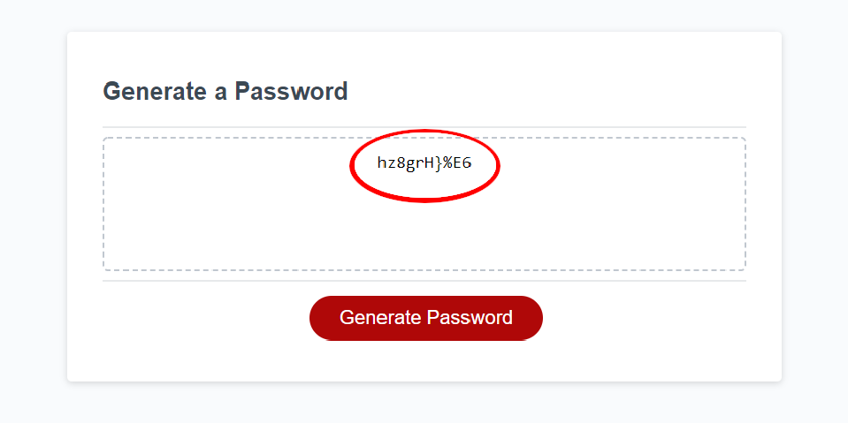

# Password Generation Apllication

## Outline
When the button is pressed, 5 prompts will come up asking for the specifications of the password

Specifications include:
- Length (8-128)
- Lowercase Letters
- Uppercase Letters
- Numeric Characters
- Special Characters

After prompts are answered, the form will give a password based on the specifications

Figures shown below:

## Coding Notes
The password generation works 99% of the time, where in the small chance that the generated password does not include all the specifications.
This is because the program starts out with a base of the first specified characters (lowercase, uppercase, ect.) and then replaces parts of the string.
This means that sometimes, the important characters get replaced by other characters, i.e. Uppercase letters get replaced by numbers and specials.

To prevent this from happening, I have made a check function that will repeat the generation process if inconsistencies are found.
Understand that this is why the code will seem a bit bloated.

Also note that the code includes a lot of edge cases.
There are edge cases in these scenarios:
- The user typed in out of bounds integers during the length prompt
- The user did not type an integer during the length prompt
- The user selected "Cancel" during the length prompt
- The user selected none of the 4 character choices
